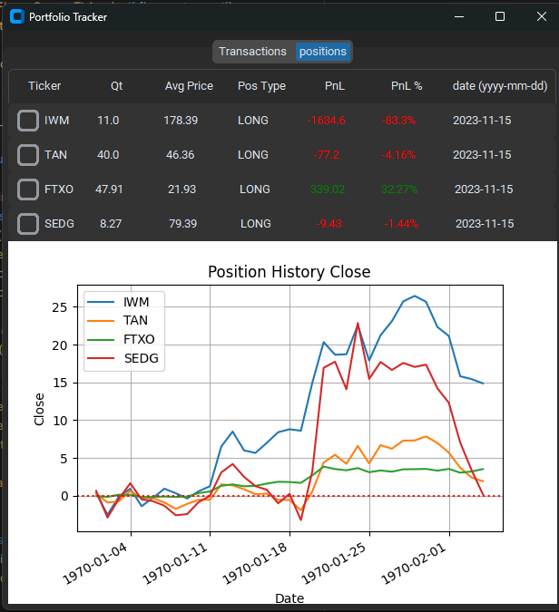

## customtkinter stock portfolio tracker app

### warning: still work in progress

### Description

This is a stock portfolio tracker app that I made using customtkinter and the yahoo finance api. It allows you to add stocks to a portfolio and track their performance over time. It also allows you to see the performance of the portfolio as a whole.

### transactions Tab View 

### positions Tab View
